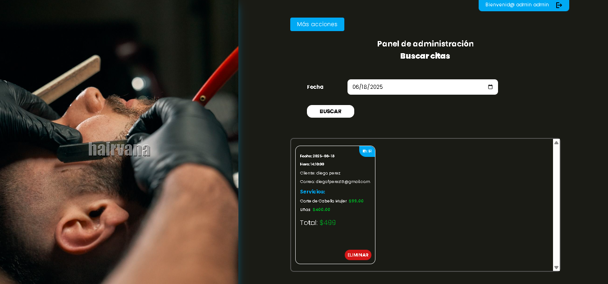
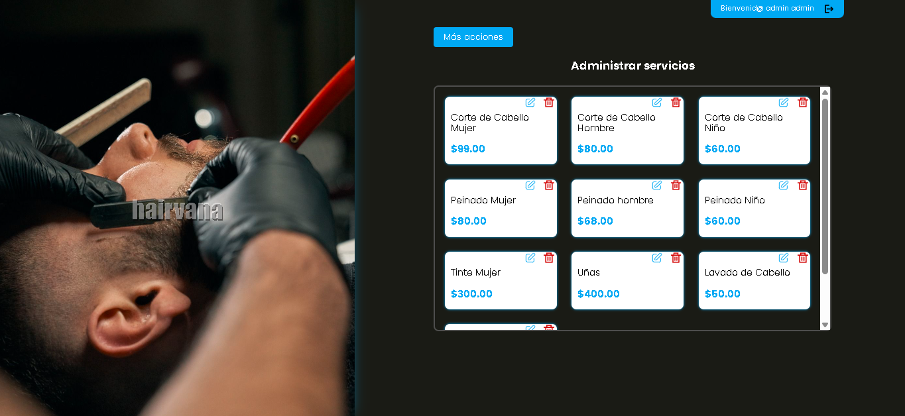
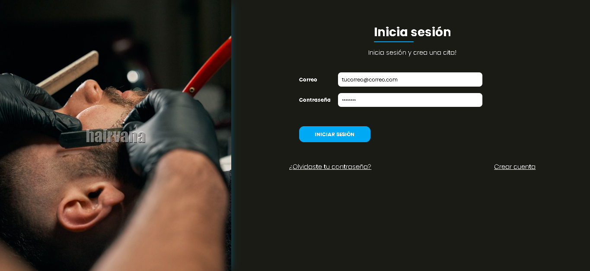
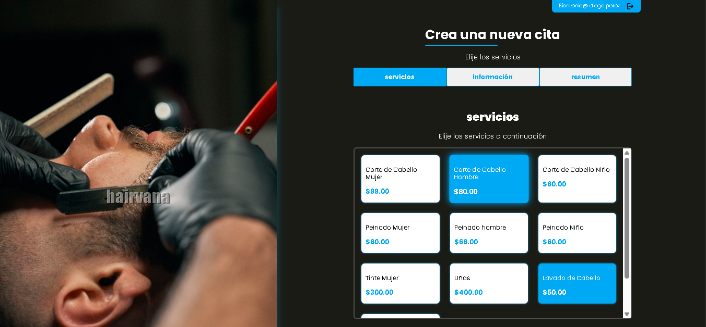
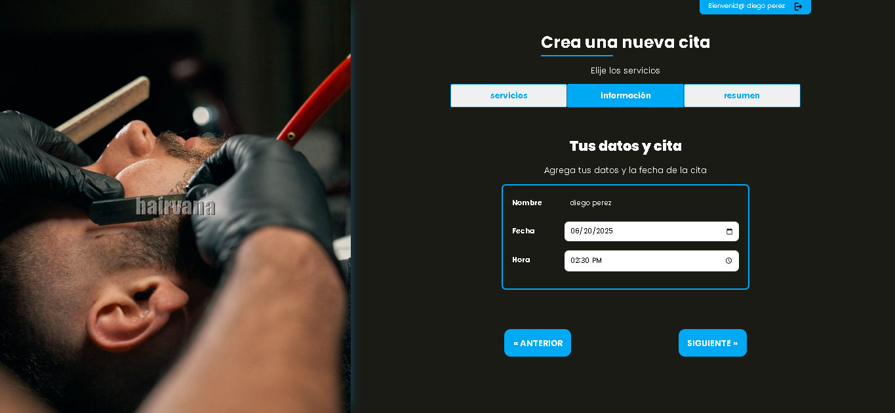
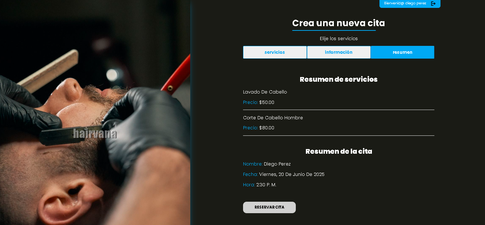
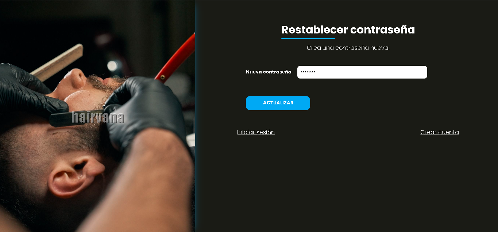

# Hairvana

Hairvana is a web application designed for a hair salon, allowing users to book customized appointments and manage their accounts, while administrators can manage the salon's services and appointments.

---

## 📄 Project Details

* **Tech Stack**: Vanilla PHP, JavaScript, SCSS, MySQL
* **Architecture**: MVC pattern
* **Build Tools**: Gulp

---

## ✨ Features

### 💼 Admin

* Manage services
* Manage appointments by date

### 👤 Users

* Create and manage their account
* Select and reserve custom appointments (choose services, date, and time)
* Recover their password via email if forgotten

---

## 📸 Screenshots

### 1. Manage Appointments



### 2. Manage Services



### 3. Account Login



### 4. Appointment Creation Process

Step 1


Step 2


Step 3


### 5. Password Recovery



---

## ▶️ Execute the Project

You can execute the project using either PHP's built-in server or Apache:

### Using PHP Local Server

1. Navigate to the `public` folder:

   ```bash
   cd public
   ```
2. Start the PHP server:

   ```bash
   php -S localhost:3000
   ```

### Using Apache

1. Move the project to the `htdocs` folder of your Apache server.
2. Configure the `.htaccess` files:

   * Place a `.htaccess` file in the root of the project.
   * Place another `.htaccess` file in the `public` folder.

For an example of how to configure these files, refer to [this gist](https://gist.github.com/JCervantesB/4ebff26de0d75c3598290d2db351825d).

---

## 🔢 Set Environment Variables

In the `./includes/` folder, create a `.env` file to define your environment variables. These include database connection details and email settings. Below is an example of how the `.env` file should look:

```env
DB_HOST=localhost
DB_USERNAME=yourusername
DB_PASSWORD=yourpassword
DB_NAME=hairvana

EMAIL_HOST=youremailhost
EMAIL_USERNAME=youremailusername
EMAIL_PORT=2525
EMAIL_PASSWORD=youremailpassword

APP_URL=http://localhost:3000
```

---

## 📊 Create Database Tables

To set up the database, import the SQL file located in the root directory of the project:

1. Locate the `./db.hairvana.sql` file.
2. Use your preferred database management tool (e.g., phpMyAdmin or MySQL CLI) to execute the SQL commands and create the necessary tables.

Example using MySQL CLI:

```bash
mysql -u yourusername -p yourpassword hairvana < ./db.hairvana.sql
```

---

## 📝 Additional Notes

* Ensure that your PHP version meets the requirements specified in the `composer.json` file.
* Make sure your Apache server has `mod_rewrite` enabled if using Apache to serve the application.
* The `.env` file should not be committed to version control to maintain the security of sensitive information.

---

## ⚖️ License

This project is for educational purposes.

---

## 🙌 Contributing

If you find a bug or want to contribute, feel free to fork the repo and submit a pull request!
